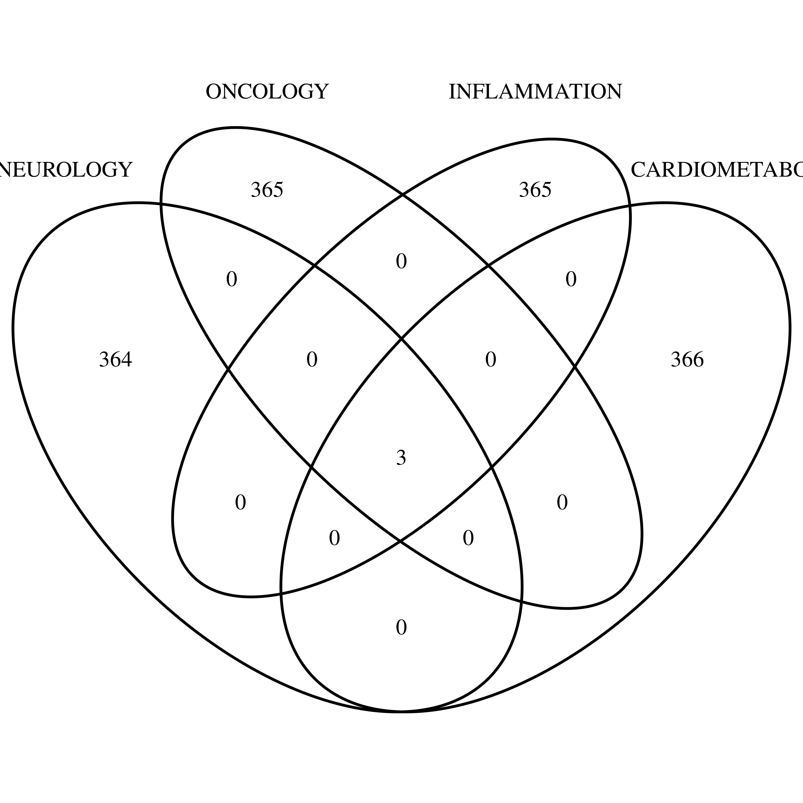

## The working directory

/rds/project/jmmh2/rds-jmmh2-projects/olink_proteomics/scallop/NGS 

### Protein information

Results at work/ are according to the combination of,

* NGS panels -- CARDIOMETABOLIC, INFLAMMATION, NEUROLOGY.
* qPCR panels -- cvd2, cvd3, inf, neu.
* QC types:
  * raw -- raw measurements
  * QC -- NGS QC=PASS
  * LOD -- set to be NA when < LOD
  * col1 -- set to NA when 01

for a total of 16 NGS-Olink-QC combinations, with suffexes .dat for correlation and .pdf for scatter plots.

qPCR panel | Four combinations
--------|--------------------:
cvd2 | CARDIOMETABOLIC-cvd2 + [-col1, -LOD, -QC, -raw]
cvd3 | CARDIOMETABOLIC-cvd3 + [-col1, -LOD, -QC, -raw]
inf | INFLAMMATION-inf + [-col1, -LOD, -QC, -raw]
neu | NEUROLOGY-neu + [-col1, -LOD, -QC, -raw]

The Olink NGS QC=PASS appears to have the highest correlation.

The corresponding density plots are shown in correlogram.pdf. 

### Genotype-protein association

**plink2/** contains genotype-protein association results for MAF>=0.05, INFO>=0.8.

NGS.merge is contained for each of the following p value thresholds,

Directory | Description | Sentinels | Proteins
----------|-------------|----------:|--------------------:
1e-5/ | sentinel identification at p=1e-5 | 22,876 | 1,472
1e-6/ | sentinel identification at p=1e-6 |  2,788 | 1,241
1e-7/ | sentinel identification at p=1e-7 |    565 |   479

Note that the following three proteins appear on all four panels and should be treated specifically,
```
P01375   TNF
P05231   IL6
P10145 CXCL8
```
see the Venn diagram. 
